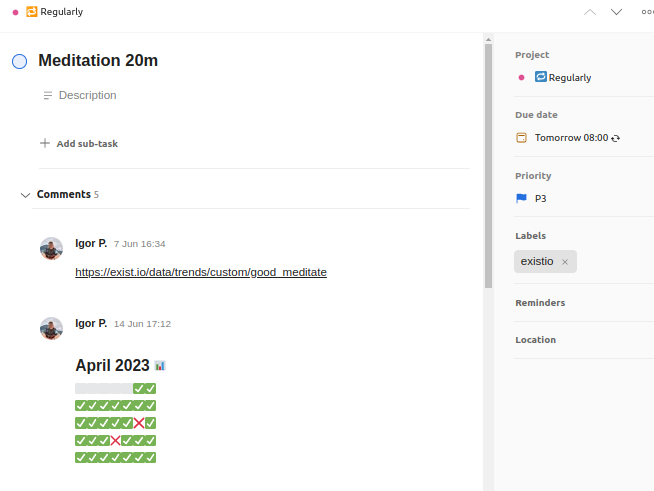

# Habits + Todoist = Habist

## About

Habist is a FastAPI project written in Python that provides webhooks for Todoist. It allows you to mark and unmark
custom tags in Exist.io by simply completing tasks in Todoist. This integration helps you synchronize your habit
tracking between Todoist and Exist.io.

## Motivation

I use [Exist.io](https://exist.io/) to log my habits, but I also rely on [Todoist](https://todoist.io/) for task
management and reminders. To bridge the gap between the two, I created Habist. It enables me to update Exist.io with the
completion status of my tasks in Todoist, ensuring that my habit tracking remains accurate.

## Commands

Use these commands by commenting on a task in Todoist:

* `existio:TAGNAME` - to connect the task with a custom tag in Exist.io
* `existio:release` - to disconnect the task from a custom tag in Exist.io (or simply delete the task)
* `existio:yesterday` - to set this custom tag in Exist.io for yesterday
* `existio:on:YYYY-MM-DD` - to set this custom tag in Exist.io for custom date
* `existio:off:YYYY-MM-DD` - to UNset this custom tag in Exist.io for yesterday
* `existio:off:today` - to UNset this custom tag in Exist.io for today
* `existio:off:yesterday` - to UNset this custom tag in Exist.io for yesterday
* `existio:update` - force stats update

Another way to execute command is to change Task's description to `/COMMAND`.

**To set the custom tag for today, simply check task as done! ✅✅✅**

## Demo

After the task connected with the custom tag the former will have comments with up-to-date statistics:

## Useful links

* [Todoist App Console](https://developer.todoist.com/appconsole.html)
* [Exist.io App Management](https://exist.io/account/apps/)

## Note

Habist was initially developed to fulfill my own needs and to practice using FastAPI. However, I've decided to share it
with the world.

If you're interested in using Habist for yourself, feel free to contact me. Thank you!

## Licence

MIT License
